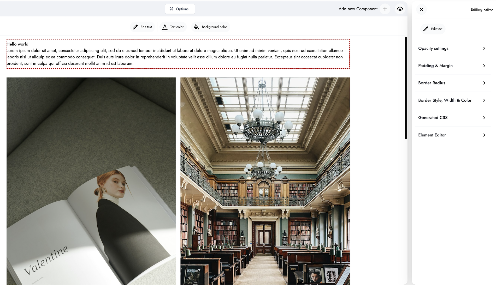

<p align="center" dir="auto">

</p>

## **DEVELOPMENT VERSION - NOT READY FOR PRODUCTION**

🚀 **Official Launch Date: June 15, 2025**  
We're working hard to bring you a production-ready page builder. Stay tuned for updates!

You are welcome to test the builder and report any bugs or feedback before the official launch date.  
Your input will help us deliver a more stable and feature-rich release!

# Free Click & Drop Page Builder

## Overview

A Vue 3 page builder component with drag & drop functionality for creating dynamic web pages.

## Installation

The web builder for stunning pages. Enable users to design and publish modern pages at any scale.

```bash
npm install @myissue/vue-website-page-builder
```

## Click & Drop Page Builder

[Play around with the Page Builder](https://www.builder-demo.myissue.dk)

Lightweight & Minimalist Page Builder with an elegant and intuitive design, focused on simplicity and speed.

Build responsive pages like listings, jobs or blog posts and manage content easily using the free Click & Drop Page Builder.

To star the repository, simply click on the **Star** button located at the top-right corner of the GitHub page. Thank you in advance for your support! 🙌

## Demo

Introducing the **The Lightweight Free Vue Click & Drop Page Builder**
create and enhance digital experiences with Vue on any backend.

[Play around with the Page Builder](https://www.builder-demo.myissue.dk)

## About

A Page Builder designed for growth. Build your website pages with ready-made components that are fully customizable and always responsive, designed to fit every need. A powerful Page Builder for growing merchants, brands, and agencies.



## Features

Includes:

- **Page Builder**: Click & Drop Page Builder.
- **Customizable Design**: Tailor the look to match your brand.

The Page Builder is packed with features:

- **Click & Drop**: Easily rearrange elements on your page.
- **Reordering**: Change the order of your content without hassle.
- **True Visual Editing**: See your changes in real-time as you make them.
- **Media Library**: Access and manage your media files effortlessly.
- **Unsplash**: Unsplash Integration.
- **Responsive Editing**: Ensure your site looks great on all devices.
- **Text Editing:** Edit text content live and in real-time.
- **Font Customization**: Choose the perfect fonts to match your style.
- **Undo & Redo**: Experiment confidently with the ability to revert changes.
- **Global Styles**: Global Styles for fonts, designs, & colors.
- **YouTube Videos**: Integrate video content smoothly.

Powerful Page Builder for any growing merchants, brands, &
agencies. Empower users to create the perfect content with the Page Builder.

## Technical details

- **Technologies**: This Page Builder is developed using TypeScript, Vue 3, the Composition API, Pinia, CSS, Tailwind CSS, and HTML.
- **Features**: Click & Drop Page Builder.

## Documentation

### Requirements

Please note that these instructions assume you have Node.js installed.

- Node.js ≥ 18.0.0
- Vue.js ≥ 3.0.0
- Modern browser with ES6+ support

### Getting started & installation

Make sure to install the dependencies:

```bash
# npm
npm install

# pnpm
pnpm install

# yarn
yarn install

# bun
bun install
```

### Important: CSS Import Required

The Page Builder requires its CSS file to be imported for proper styling and automatic icon loading:

```js
import '@myissue/vue-website-page-builder/style.css'
```

This import automatically includes:

- ✅ Page Builder styles
- ✅ Google Fonts (Jost, Cormorant - no additional setup needed)
- ✅ Google Material Icons (no additional setup needed)
- ✅ Responsive design utilities

### Quick Start

Get up and running quickly and initializing the builder in your Vue project. The following example demonstrates the minimal setup required to start building pages.

- The Page Builder requires its CSS file to be imported for proper styling and automatic icon loading:

```vue
<script setup>
import { PageBuilder } from '@myissue/vue-website-page-builder'
import '@myissue/vue-website-page-builder/style.css'
</script>

<template>
  <PageBuilder />
</template>
```

### Optional: Provide Config to PageBuilder

Get up and running quickly by importing the PageBuilder component, setting up your configuration, and initializing the builder in your Vue project. The following example demonstrates the minimal setup required to start building pages with your own config and logo.

- Use `sharedPageBuilderStore` to ensure the external PageBuilderClass and internal PageBuilder component share the same state
- (Optional) Provide a `configPageBuilder` object to customize the builder, such as:
  - `pageBuilderLogo` to display your company logo in the builder toolbar
  - `resourceData` to prefill the builder with initial data
  - `userSettings` to set user preferences such as theme, language, or autoSave
  - `formName` (recommended): Specify the resource type (e.g., `"article"`, `"jobPost"`, `"store"`, etc.) in the `updateOrCreate` config. This is especially useful if your platform supports multiple resource types. By providing a unique name, the Page Builder can correctly manage layouts and local storage for each resource type, allowing users to continue where they left off for different resources.

```vue
<script setup>
import {
  PageBuilder,
  PageBuilderClass,
  sharedPageBuilderStore,
} from '@myissue/vue-website-page-builder'
import '@myissue/vue-website-page-builder/style.css'

const configPageBuilder = {
  updateOrCreate: {
    // Set the resource type for better local storage and multi-resource support
    formName: 'article',
  },
  pageBuilderLogo: {
    src: '/logo/logo.svg',
  },
  userForPageBuilder: { name: 'John Doe' },
  resourceData: {
    title: 'Demo Article',
    id: 1,
  },
  userSettings: {
    theme: 'light',
    language: 'en',
    autoSave: true,
  },
}

// Use sharedPageBuilderStore for shared state between PageBuilderClass and PageBuilder component
const pageBuilderStateStore = sharedPageBuilderStore
const pageBuilderClass = new PageBuilderClass(pageBuilderStateStore)

// Initializing with essential configuration
pageBuilderClass.setConfigPageBuilder(configPageBuilder)
</script>

<template>
  <PageBuilder />
</template>
```

### Company Logo & Logged-in User

You can display your company logo in the Page Builder interface and set the currently logged-in user by passing both a logo URL and user information in your config object:

- **Company Logo:** Set the logo URL in your config object and pass it to the PageBuilder using `pageBuilderClass.setConfigPageBuilder(configPageBuilder)`. When provided, the logo will appear at the top of the Page Builder with proper spacing in the toolbar.
- **Logged-in User:** Pass a `userForPageBuilder` object in your config to display or use the logged-in user's information within the builder (e.g., for audit trails, personalization, or permissions).

**Basic Usage:**

- You can display your company logo in the page builder interface by setting the `src` in your config object and passing it to the PageBuilder using `pageBuilderClass.setConfigPageBuilder(configPageBuilder)`. When provided, the logo will appear in the top of the page builder.

Basic Usage:

```vue
<script setup>
import {
  PageBuilder,
  PageBuilderClass,
  sharedPageBuilderStore,
} from '@myissue/vue-website-page-builder'
import '@myissue/vue-website-page-builder/style.css'

const configPageBuilder = {
  pageBuilderLogo: {
    src: '/logo/logo.svg',
  },
  userForPageBuilder: { name: 'John Doe' },
}

// Use sharedPageBuilderStore for shared state between PageBuilderClass and PageBuilder component
const pageBuilderStateStore = sharedPageBuilderStore
const pageBuilderClass = new PageBuilderClass(pageBuilderStateStore)

// Initializing with essential configuration
pageBuilderClass.setConfigPageBuilder(configPageBuilder)
</script>

<template>
  <PageBuilder />
</template>
```

Configuration Options

| Prop              | Type     | Default | Description                         |
| ----------------- | -------- | ------- | ----------------------------------- |
| `PageBuilderLogo` | `String` | `null`  | URL path to your company logo image |

### Local Storage

The Page Builder automatically manages all changes using the browser's local storage. Every change you make—such as adding, editing, or deleting components—is saved in local storage. This ensures that your progress is not lost, even if you accidentally close the browser or navigate away.

- **Auto-Save:** The builder periodically auto-saves your changes to local storage, so you don't have to worry about losing your work.
- **Manual Save:** When the user clicks the Save button, the current state is also saved to local storage.

#### Resource-Specific Storage Keys

Each save is stored in local storage using a unique key. The key is determined by whether you are creating a new resource or updating an existing one:

- **New Resource:** The key will be prefixed with `page-builder-create-resource`.
- **Updating Resource:** The key will be prefixed with `page-builder-update-resource`.

You can further customize and uniquely identify the storage key by providing a `formName` in your `configPageBuilder`:

```js
<script setup>
import {
  PageBuilder,
  PageBuilderClass,
  sharedPageBuilderStore,
} from '@myissue/vue-website-page-builder'
import '@myissue/vue-website-page-builder/style.css'


const configPageBuilder = {
  updateOrCreate: {
    // Set the resource type for better local storage and multi-resource support
    formName: 'article',
  },
  // ...other config options
}

const pageBuilderClass = new PageBuilderClass(pageBuilderStateStore)

// Initializing with essential configuration
pageBuilderClass.setConfigPageBuilder(configPageBuilder)
// Populating page builder with existing resource content
pageBuilderClass.loadExistingContent(existingResourceFromBackend)
</script>


<template>
  <PageBuilder />
</template>
```

This allows you to manage drafts for multiple resource types (e.g., articles, jobs, stores) independently in local storage.

> **Tip:** The local storage key will automatically include the resource type if `formName` is provided, ensuring that drafts for different resource types do not overwrite each other.

### Restoring Unfinished Drafts for New Resources

If a user started creating a new resource but hasn't finished (e.g., they want to continue the next day), you can restore their draft from local storage:

- Set `formType` to `"create"` in your config object.
- The PageBuilder will automatically look for any saved draft in local storage (based on the resource type) and load it if available.

**Example: Set `formType` to "create" for continuing a new resource draft**

```js
<script setup>
import {
  PageBuilder,
  PageBuilderClass,
  sharedPageBuilderStore,
} from '@myissue/vue-website-page-builder'
import '@myissue/vue-website-page-builder/style.css'

const pageBuilderStateStore = sharedPageBuilderStore

const configPageBuilder = {
  updateOrCreate: {
    formType: 'create',
    formName: 'article',
  },
}

const pageBuilderClass = new PageBuilderClass(pageBuilderStateStore)

// Initializing with essential configuration
pageBuilderClass.setConfigPageBuilder(configPageBuilder)
// No need to call loadExistingContent; the builder will auto-restore from local storage if available
</script>

<template>
  <PageBuilder />
</template>
```

> **Tip:** Use `formType: 'create'` for new resources and `formType: 'update'` for editing existing resources. This ensures the correct local storage key is used and the right content is loaded.

### Loading Published Content from the Backend into the Page Builder

To load existing content that was created with this PageBuilder from any backend:

- Use `sharedPageBuilderStore` to ensure the external `PageBuilderClass` and internal `PageBuilder` component share the same state.
- Import `PageBuilderClass` which contains all methods to manipulate and control the page builder state. Use the `loadExistingContent()` method to load existing content into the page builder.
- The `PageBuilderClass` uses the shared store to maintain state consistency between external operations and the internal `PageBuilder` component, ensuring that when you load content externally it appears correctly in the PageBuilder interface.
- Set `formType` to `"update"` in your config object and pass it to the PageBuilder using `pageBuilderClass.setConfigPageBuilder(configPageBuilder)`. This tells the PageBuilder that you're editing an existing resource rather than creating a new one, which affects how the component handles data and interactions.

**Example: Set `formType` to "update" for editing an existing resource**

```js
<script setup>
import {
  PageBuilder,
  PageBuilderClass,
  sharedPageBuilderStore,
} from '@myissue/vue-website-page-builder'
import '@myissue/vue-website-page-builder/style.css'

const pageBuilderStateStore = sharedPageBuilderStore

const configPageBuilder = {
  updateOrCreate: {
    formType: 'update',
    formName: 'article',
  },
}

const pageBuilderClass = new PageBuilderClass(pageBuilderStateStore)

// Initializing with essential configuration
pageBuilderClass.setConfigPageBuilder(configPageBuilder)
// Populating page builder with existing resource content from backend
pageBuilderClass.loadExistingContent(existingResourceFromBackend)
</script>

<template>
  <PageBuilder />
</template>
```

#### How should `existingResourceFromBackend` look?

When loading an existing resource, each component object will have an `id` assigned by the page builder.  
The example below shows the structure as it would appear when loaded from local storage after components have been added in the builder.

- Example JSON string (from localStorage or backend)
- For existing resources, id will always be present and set by the page builder.

TypeScript interface for reference

```javascript
export interface ComponentObject {
  id: string | number | null
  html_code: string
  title?: string
}
```

Alternatively, you can provide a raw HTML string containing your `<section>` components:

### Customization

Customizing the page builder is made simple since all the logic resides in the PageBuilder Class.

### Custom Components

Want to add your own media library or Create custom components that can be injected into the page builder:

📚 **[Custom Components Setup Guide](./CUSTOM_COMPONENTS_SETUP.md)** - Learn how to create and integrate your own components

Example integration:

```javascript
<script setup>
import { PageBuilder } from '@myissue/vue-website-page-builder'
import YourMediaLibraryComponent from './ComponentsPageBuilder/YourMediaLibraryComponent.vue'
import YourSearchComponent from './ComponentsPageBuilder/YourSearchComponent.vue'
</script>

<template>
  <PageBuilder :CustomMediaLibraryComponent="YourMediaLibraryComponent" :CustomSearchComponent="YourSearchComponent" />
</template>
```

## Troubleshooting

### Fonts or Icons Not Displaying

If fonts (Jost, Cormorant) or Material Icons are not displaying correctly, verify that:

1. **CSS Import**: Ensure you're importing the CSS file:

   ```js
   import '@myissue/vue-website-page-builder/style.css'
   ```

2. **Network Access**: The package loads fonts and icons from Google Fonts CDN. Ensure your application can access:

   ```
   https://fonts.googleapis.com/css2?family=Jost:*
   https://fonts.googleapis.com/css2?family=Cormorant:*
   https://fonts.googleapis.com/css2?family=Material+Symbols+Outlined

   ```

3. **Content Security Policy**: If using CSP, allow Google Fonts:
   ```html
   <meta
     http-equiv="Content-Security-Policy"
     content="font-src 'self' https://fonts.googleapis.com;"
   />
   ```

## Contributing

1. Fork the repository
2. Create your feature branch
3. Make your changes
4. Build and test locally
5. Submit a pull request

## Security Vulnerabilities

If you discover a security vulnerability, please send us a message.

## Get in touch for customization or any questions

If you have any questions or if you're looking for customization, feel free to connect with our developer.

- [Email](mailto:qais.wardag@outlook.com)
- [LinkedIn](https://www.linkedin.com/in/qaiswardag)

## Feedback

Suggestions, or any issues you encounter while using this app. Feel free to reach out.

## Support the Project

We would greatly appreciate it if you could star the GitHub repository. Starring the project helps to boost its visibility.

## License

[MIT License](./LICENSE)
