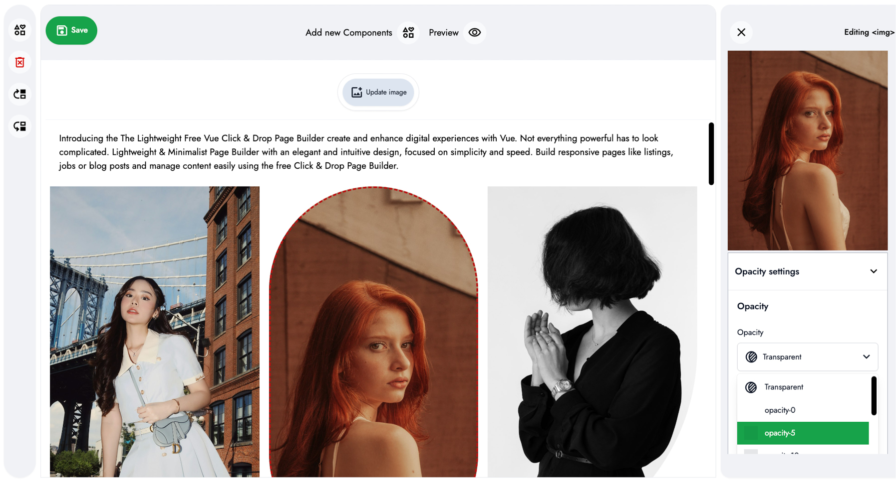
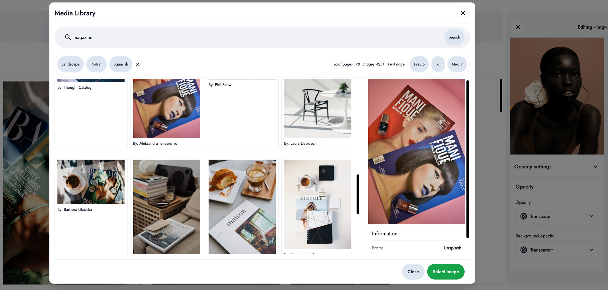
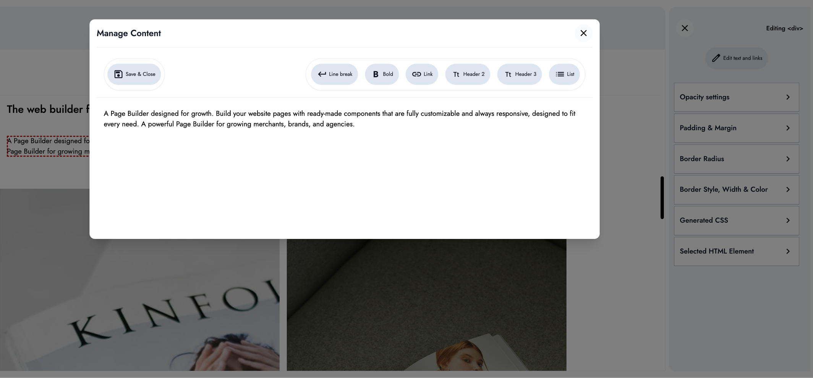
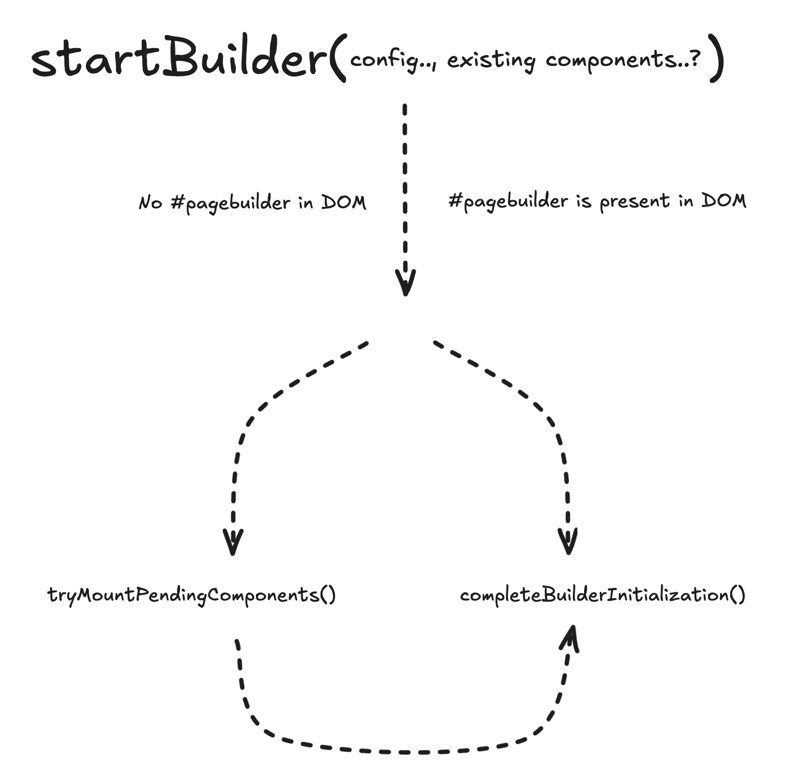

<p align="center" dir="auto">

</p>

# Free Click & Drop Page Builder

- [Free Click \& Drop Page Builder](#free-click--drop-page-builder)
  - [Demo](#demo)
  - [Overview](#overview)
  - [Get Started in Minutes](#get-started-in-minutes)
  - [Installation](#installation)
  - [About](#about)
  - [Features](#features)
  - [Technical details](#technical-details)
  - [Documentation](#documentation)
  - [Requirements](#requirements)
  - [Getting started \& installation](#getting-started--installation)
  - [Quick Start](#quick-start)
    - [Initializing the Page Builder](#initializing-the-page-builder)
    - [Why Use the Shared Instance?](#why-use-the-shared-instance)
    - [Using the Page Builder Component](#using-the-page-builder-component)
  - [Important: CSS Prefixing (`pbx-`)](#important-css-prefixing-pbx-)
  - [Rendering HTML Output in Other Frameworks (React, Nuxt, etc.)](#rendering-html-output-in-other-frameworks-react-nuxt-etc)
  - [Providing Configuration to the Page Builder](#providing-configuration-to-the-page-builder)
  - [Local Storage \& Auto-Save](#local-storage--auto-save)
  - [Retrieving the Latest HTML Content for Form Submission](#retrieving-the-latest-html-content-for-form-submission)
    - [Resetting the Builder After Successful Resource Creation or Update](#resetting-the-builder-after-successful-resource-creation-or-update)
  - [Loading existing Content or Components into the Page Builder](#loading-existing-content-or-components-into-the-page-builder)
  - [Automatic Draft Recovery](#automatic-draft-recovery)
  - [Embedding Page Builder in a Modal or Dialog](#embedding-page-builder-in-a-modal-or-dialog)
  - [Styling the Main Page Builder Container](#styling-the-main-page-builder-container)
  - [Download HTML file](#download-html-file)
  - [Custom Components](#custom-components)
    - [Custom Media Library Component](#custom-media-library-component)
    - [Integrate Unsplash Library](#integrate-unsplash-library)
    - [Custom Layout Builder Component](#custom-layout-builder-component)
  - [Troubleshooting](#troubleshooting)
    - [Fonts or Icons Not Displaying](#fonts-or-icons-not-displaying)
  - [Page Builder Architecture](#page-builder-architecture)
    - [How the Page Builder Works](#how-the-page-builder-works)
  - [Contributing](#contributing)
  - [Security Vulnerabilities](#security-vulnerabilities)
  - [Get in touch for customization or any questions](#get-in-touch-for-customization-or-any-questions)
  - [Feedback](#feedback)
  - [Support the Project](#support-the-project)
  - [License](#license)

## Demo

A Vue 3 page builder component with drag & drop functionality for creating dynamic web pages.

Create and enhance digital experiences with Vue on any backend.

Experience the power and simplicity of the Vue Website Page Builder in action.
Try the live demo to explore real-time visual updates, and smooth content management

[Play around with the Page Builder](https://www.builder-demo.myissue.dk)

## Overview

If you're a Vue 3 developer, this builder feels right at home. It installs quickly via npm and supports full customization through props and configuration objects. You can even set specific user settings like image, name, theme, language, company logo and autosave preferences, making it a personalized experience for every user.

Lightweight & Minimalist Page Builder with an elegant and intuitive design, focused on simplicity and speed.

Build responsive pages like listings, jobs or blog posts and manage content easily.



## Get Started in Minutes

Easy setup and instant productivity.  
Follow the [Quick Start](#quick-start) guide to begin building with just a few simple steps.

---

## Installation

The web builder for stunning pages. Enable users to design and publish modern pages at any scale.

```bash
npm install @myissue/vue-website-page-builder
```

---

## About

A Page Builder designed for growth. Build your website pages with ready-made components that are fully customizable and always responsive, designed to fit every need. A powerful Page Builder for growing merchants, brands, and agencies.



## Features

Includes:

- **Page Builder**: Click & Drop Page Builder.
- **Customizable Design**: Tailor the look to match your brand.

The Page Builder is packed with features:

- **Click & Drop**: Easily rearrange elements on your page.
- **Reordering**: Change the order of your content without hassle.
- **True Visual Editing**: See your changes in real-time as you make them.
- **Media Library**: Easily inject your own custom media library component.
- **Local Storage & Auto-Save**: Never lose your work - changes are saved as you go.
- **Unsplash**: Unsplash Integration.
- **Responsive Editing**: Ensure your site looks great on all devices.
- **Text Editing**: Edit text content live and in real-time.
- **Font Customization**: Choose the perfect fonts to match your style.
- **Undo & Redo**: Experiment confidently with the ability to revert changes.
- **Global Styles**: Global Styles for fonts, designs, & colors.
- **YouTube Videos**: Integrate video content smoothly.
- **Download HTML**: Export the entire page as a standalone HTML file.
- **Global Page Styling**: Instantly define, update, or clear global styles for the main page wrapper at initialization or dynamically at runtime. Gain full control over fonts, colors, backgrounds, and more for a dynamic user experience.
- **Tailwind Support**: Fully compatible with Tailwind CSS (with automatic class prefixing to avoid conflicts).
- **Styles Prefixed**: To ensure clean and predictable styling, the builder uses Scoped Style Isolation. No risk of style conflicts between the builder and your app.

Powerful Page Builder for any growing merchants, brands, & agencies. Empower users to create the perfect content with the Page Builder.



## Technical details

- **Technologies**: This Page Builder is developed using TypeScript, Vue 3, the Composition API, Pinia, CSS, Tailwind CSS, and HTML.
- **Features**: Click & Drop Page Builder.

## Documentation

Find everything you need to get started, configure, and master the Vue Website Page Builder.
This section covers installation, requirements, quick start, advanced usage, and integration tips—so you can build and launch pages with confidence.

## Requirements

Please note that these instructions assume you have Node.js installed.

- Node.js ≥ 18.0.0
- Vue.js ≥ 3.0.0
- Modern browser with ES6+ support

## Getting started & installation

Make sure to install the dependencies:

```bash
# npm
npm install

# pnpm
pnpm install

# yarn
yarn install

# bun
bun install
```

## Quick Start

Get up and running with the Vue Website Page Builder in just a few minutes.
This section walks you through the essential steps—from installation to rendering your first page—so you can start building beautiful, dynamic content right away.

### Initializing the Page Builder

To get started with the Page Builder, follow these steps:

- **Call `initPageBuilder()` once** in your application entry point (e.g., `main.ts` or `main.js`). This sets up the shared builder instance for your entire app.
- **Access the shared builder instance** anywhere in your application using the `getPageBuilder()` composable.
- **Import the CSS file once** in your `main.js`, `main.ts`, or root component to ensure proper styling and automatic icon loading.

```typescript
import { createApp } from 'vue'
import App from './App.vue'
import { initPageBuilder } from '@myissue/vue-website-page-builder'
import '@myissue/vue-website-page-builder/style.css'

// Initialize the shared Page Builder instance
// This must be called once in your app entry point
initPageBuilder()

const app = createApp(App)
app.mount('#app')
```

> **Note:**  
> You only need to import the CSS file once. If you have already imported it in your app entry, you do not need to import it again in individual components.

> **Note**  
> The Page Builder is implemented as a singleton service. This ensures that all page-building logic and state are managed by a single, shared instance throughout your application.

### Why Use the Shared Instance?

By always accessing the shared instance, you avoid creating multiple, isolated copies of the builder. This prevents data inconsistencies, synchronization issues, and unpredictable behavior. All components and modules interact with the same centralized service, ensuring that updates and state changes are reflected everywhere in your application.

### Using the Page Builder Component

Ensure the following configuration options are set:

- **`formType` (required):**  
  Indicates whether you are creating or updating a resource. This is used to retrieve the correct content from local storage.

- **`formName` (required):**  
  Specifies the resource type (for example, `article`, `jobPost`, `store`, etc.).

```vue
<script setup>
import { PageBuilder, getPageBuilder } from '@myissue/vue-website-page-builder'
import '@myissue/vue-website-page-builder/style.css'

const configPageBuilder = {
  updateOrCreate: {
    formType: 'create',
    formName: 'article',
  },
}

const pageBuilderService = getPageBuilder()
const result = await pageBuilderService.startBuilder(configPageBuilder)

console.info('You may inspect this result for message, status, or error:', result)
</script>

<template>
  <PageBuilder />
</template>
```

## Important: CSS Prefixing (`pbx-`)

All CSS classes generated or processed by the Page Builder—including Tailwind utilities and your custom classes—are automatically prefixed with `pbx-`. This ensures the builder’s styles never conflict with your app’s existing CSS or Tailwind setup.
This prevents global styles from leaking into the builder and vice versa, which is crucial for embedding the builder into larger apps or white-label environments.

**How does this affect you?**

When a user adds a component into the page builder, all classes from that component are automatically prefixed with pbx- (e.g., pbx-button, pbx-container) to ensure style isolation and avoid conflicts.

> **Note:**  
> Simply import the builder’s CSS file once in your project. All builder styles are namespaced, so there is no risk of style conflicts

## Rendering HTML Output in Other Frameworks (React, Nuxt, etc.)

You can use the Page Builder to generate HTML and render it in any frontend framework, such as React, Nuxt, or even server-side apps.

To ensure your content is styled correctly, simply install the Page Builder package in your target project and import its CSS file. All builder and Tailwind-prefixed styles will be applied automatically.

```js
// Import the builder's CSS file once in your project
import '@myissue/vue-website-page-builder/style.css'
```

This will apply all necessary styles to any HTML output from the builder, even if you render it with `dangerouslySetInnerHTML`, `v-html`, or similar methods.

**Example (React):**

```jsx
import '@myissue/vue-website-page-builder/style.css'

function MyPage({ html }) {
  return <div dangerouslySetInnerHTML={{ __html: html }} />
}
```

**Example (Nuxt/Vue):**

```vue
<script setup>
import '@myissue/vue-website-page-builder/style.css'
</script>
```

Then use `v-html` to render the HTML.

> **Note:**  
> You do not need to import any Vue components if you only want to render the HTML. Just import the CSS file.

## Providing Configuration to the Page Builder

The example below demonstrates the setup to start building pages, with additional options available for customization and branding.

Your `configPageBuilder` object can include:

- **`formType` (required):**  
  Used to retrieve the correct content from local storage. Specify whether you are creating or updating a resource.
- **`formName` (required):**  
  The resource type (e.g., `article`, `jobPost`, `store`, etc.). This is especially useful for platforms supporting multiple resource types, allowing the builder to manage layouts and storage for each resource uniquely.
- **`resourceData` (optional):**  
  Prefill the builder with initial resource data (e.g., `title`, `id`).
- **`userForPageBuilder` (optional):**  
  Pass user information (such as `name` and `image`) to display the logged-in user’s details in the builder.
- **`pageBuilderLogo` (optional):**  
  Display your company logo in the builder toolbar.
- **`userSettings` (optional):**  
  Set user preferences such as theme, language, or auto-save.
- **`brandColor` (optional):**  
  Set your brand’s primary color for key UI elements (inside the `settings` config).

```vue
<script setup>
import { getPageBuilder } from '@myissue/vue-website-page-builder'

const configPageBuilder = {
  updateOrCreate: {
    formType: 'create', // Set to 'create' or 'update'
    // Set the resource type for better local storage and multi-resource support
    formName: 'article',
  },
  resourceData: {
    title: 'Demo Article',
    id: 1,
  },
  userForPageBuilder: { name: 'John Doe', image: '/jon_doe.jpg' },
  pageBuilderLogo: {
    src: '/logo/logo.svg',
  },
  userSettings: {
    theme: 'light',
    language: 'en',
    autoSave: true,
  },
  settings: {
    brandColor: '#DB93B0',
  },
}

// Retrieve Page Builder service instance
const pageBuilderService = getPageBuilder()
const result = await pageBuilderService.startBuilder(configPageBuilder)

console.info('You may inspect this result for message, status, or error:', result)
</script>

<template>
  <PageBuilder />
</template>
```

## Local Storage & Auto-Save

The Page Builder automatically saves all changes to the browser’s local storage. Every time you add, edit, or delete a component, your progress is preserved—even if you close the browser or navigate away.

- **Auto-Save:** Changes are periodically saved as you work.
- **Manual Save:** Clicking the Save button also stores the current state.

## Retrieving the Latest HTML Content for Form Submission

The builder’s auto-save ensures that the data in local storage always reflects the latest state of your page. You can retrieve this data at any time for form submission, publishing, or preview.

To get the most up-to-date content, use the same `resourceData` (such as `formType` and `formName`) that was used when saving. If these values do not match, the builder may not find the expected content.

**Example:**

```js
const configPageBuilder = {
  updateOrCreate: {
    formType: 'create',
    formName: 'article',
  },
}
```

Call this logic when you need to submit or save the builder’s output—for example, when the user clicks “Save” or “Publish.” The code below safely retrieves and parses the latest data from local storage, handling errors and assigning the results to your form fields.

```vue
<script setup>
import { getPageBuilder } from '@myissue/vue-website-page-builder'

const configPageBuilder = {
  updateOrCreate: {
    formType: 'create',
    formName: 'article',
  },
}

// Retrieve Page Builder service instance
const pageBuilderService = getPageBuilder()
await pageBuilderService.startBuilder(configPageBuilder)

let storedComponents = pageBuilderService.loadStoredComponentsFromStorage()
let contentFromPageBuilder = ''

try {
  storedComponents = JSON.parse(storedComponents)
  contentFromPageBuilder =
    storedComponents && Array.isArray(storedComponents.components)
      ? storedComponents.components.map((component) => component.html_code).join('')
      : ''
} catch (e) {
  console.error('Unable to parse storedComponents from localStorage:', e)
  contentFromPageBuilder = ''
} finally {
  yourForm.content = contentFromPageBuilder
}
</script>
```

### Resetting the Builder After Successful Resource Creation or Update

After you have successfully created or updated a resource (such as a post, article, or listing) using the Page Builder, it is important to clear the builder’s draft state and remove the corresponding local storage entry. This ensures that old drafts do not appear the next time the builder is opened for a new or existing resource.

You can reset the builder state and clear the draft with:

```js
// Delete the HTML from the Live DOM
pageBuilderService.deleteAllComponentsFromDOM()
// Clear Local Storage for the created or updated resource
await pageBuilderService.removeCurrentComponentsFromLocalStorage()
```

Always call these methods after a successful post or resource update to ensure users start with a fresh builder the next time they create or edit a resource.

## Loading existing Content or Components into the Page Builder

The Page Builder makes it simple to load previously published content from any backend source, such as your database or API.

The `startBuilder` method accepts two arguments:

1. **Configuration** (required):  
   The builder configuration object.
2. **Components Data** (optional):  
   An array of component objects. Each object must include a `html_code` string and may optionally include a title string. This is especially useful when loading previously published or saved content into the builder.

**Important**

To load existing content into the Page Builder, ensure that the formType is set to update in your configuration.
This tells the builder to expect and load your provided components array as the initial content.

```vue
<script setup>
import { getPageBuilder } from '@myissue/vue-website-page-builder'

const configPageBuilder = {
  updateOrCreate: {
    formType: 'update',
    formName: 'article',
  },
}

// Retrieve the Page Builder service instance
const pageBuilderService = getPageBuilder()

// Load existing components into the builder (title is optional)
const myArticle = [
  { html_code: '<section>...</section>', title: 'Header H2' },
  { html_code: '<section>...</section>', title: 'Text' },
  { html_code: '<section>...</section>', title: 'Image' },
]

const result = await pageBuilderService.startBuilder(configPageBuilder, myArticle)

console.info('You may inspect this result for message, status, or error:', result)
</script>

<template>
  <PageBuilder />
</template>
```

> **Note:**  
> Each component’s `html_code` must be wrapped in a `<section>...</section>` tag.  
> This is how the Page Builder defines and separates individual components.

This approach ensures your users can seamlessly load and edit previously published content, providing a smooth and reliable editing.

## Automatic Draft Recovery

The Page Builder automatically checks for unsaved drafts in local storage for the current resource.  
If a draft is found, users are prompted to either continue where they left off or use the version loaded from your backend.

- **`formType` (required):**  
  Determines which draft to load from local storage. Set this to either `create` or `update` in the `updateOrCreate` config, depending on your use case.
- **`formName` (required):**  
  Specifies the resource type (e.g., `article`, `jobPost`, `store`, etc.) in the `updateOrCreate` config. This is especially important if your platform supports multiple resource types. By providing a unique name, the Page Builder can correctly manage layouts and drafts for each resource, allowing users to pick up where they left

```vue
<script setup>
import { getPageBuilder } from '@myissue/vue-website-page-builder'

const configPageBuilder = {
  updateOrCreate: {
    formType: 'update',
    formName: 'article',
  },
}

const result = await pageBuilderService.startBuilder(configPageBuilder)

console.info('You may inspect this result for message, status, or error:', result)
</script>

<template>
  <PageBuilder />
</template>
```

## Embedding Page Builder in a Modal or Dialog

You can easily use the Page Builder inside a modal or dialog.  
To allow users to close the modal from inside the builder, use the `showCloseButton` prop and listen for the `@handleClosePageBuilder` event:

```vue
<script setup>
import { ref } from 'vue'
import { PageBuilder } from '@myissue/vue-website-page-builder'

const showModal = ref(true)
function closePageBuilder() {
  showModal.value = false
}
</script>

<template>
  <Modal v-if="showModal" @close="showModal = false">
    <PageBuilder :showCloseButton="true" @handleClosePageBuilder="closePageBuilder" />
  </Modal>
</template>
```

- `:showCloseButton="true"` — shows a close button in the Page Builder toolbar.
- `@handleClosePageBuilder="closePageBuilder"` — emits when the close button is clicked, so you can close your modal.

> **Tip:**  
> You can name your handler function anything you like.  
> This pattern makes it easy to embed the builder in modals, dialogs, or overlays in any Vue app.

## Styling the Main Page Builder Container

The Page Builder allows you to define and update global styles for the main wrapper (#pagebuilder) at any time. These settings control the overall appearance, including font family, text color, background color, and more. Whether you set them initially in your config or update them dynamically at runtime, your changes are instantly reflected across all sections.

Use the `pageSettings` config to apply custom CSS classes and inline styles to the Page Builder’s main wrapper.
The Page Builder renders all components wrapped inside a single parent container `<div id="pagebuilder">`.  
You can pass global CSS ``classes` and `style` to this wrapper by adding a `pageSettings` object in your config:

```ts
const configPageBuilder = {
  // other config options...

  pageSettings: {
    classes: 'max-w-screen-lg mx-auto px-4 bg-white',
    style: {
      backgroundColor: 'red',
      border: '6px solid yellow',
    },
  },
} as const
```

You have full control over the page’s appearance at any time — instantly override or clear global styles for the entire page, ensuring a seamless and dynamic user experience.

## Download HTML file

Export the entire page as a standalone HTML file. This includes all sections, content, and applied styles, making the file ready for use or integration elsewhere.

- Images may not display correctly in the exported HTML unless their URLs are properly prefixed or fully qualified.

To ensure images render properly after export, you must specify a URL prefix in your Page Builder configuration. This prefix will be prepended to all relative image URLs during the export process.

```ts
const configPageBuilder = {
  pageSettings: {
    imageUrlPrefix: 'https://your-domain.com/uploads/',
  },
  // other config options...
} as const
```

## Custom Components

If you want to use your own components—whether custom-designed or tailored to your application's needs—you can inject them directly into the builder.

### Custom Media Library Component

By default, the Page Builder does not include a built-in media library.

This is intentional—without a custom media library, layout components that rely on images (such as Image Blocks, Hero Sections, and similar) are disabled by default. Only helper components like containers, headings, text, and buttons are available in this state.

You may extend the Page Builder by adding your own media library.
Inject your media library component easily to tailor the builder to your application's needs.

📚 **[Custom Components Setup Guide](./CUSTOM_COMPONENTS_SETUP.md)**
Learn how to create and integrate your own components step by step.

### Integrate Unsplash Library

Easily add Unsplash image search to your media library modal—just like in the demo!
Code example — You can copy-paste the provided example to get started.

See the full step-by-step guide and working demo code here:
📚 **[Unsplash Integration Guide](./UNSPLASH_INTEGRATION.md)**

### Custom Layout Builder Component

The Page Builder comes with a growing collection of built-in components, including both layout and helper components. These defaults are continuously improved and expanded.

📚 **[Custom Components Setup Guide](./CUSTOM_COMPONENTS_SETUP.md)**
Learn how to create and integrate your own components step by step.

## Troubleshooting

### Fonts or Icons Not Displaying

If fonts or Material Icons are not displaying correctly, verify that:

**CSS Import**: Ensure you're importing the CSS file:

```js
import '@myissue/vue-website-page-builder/style.css'
```

## Page Builder Architecture

The Page Builder is designed as a modular, state-driven editor for dynamic page content. Its architecture separates configuration, state management, and DOM interaction, ensuring flexibility and maintainability.

### How the Page Builder Works

The Page Builder is designed to be easy to use and flexible for any web project. Here’s how it works behind the scenes:

- **Configuration First:**  
  When you start the builder, you pass in your configuration (such as what type of page you’re building, user info, branding, and any existing content).  
  The builder saves this configuration immediately—even if the editing interface (DOM) isn’t loaded yet. This means you can safely set up the builder in advance, and it will be ready as soon as the editor appears on the page.

- **Loading Content:**  
  If you have existing content (like a published page), the builder loads it so you can keep editing. If not, you start with a blank page.

- **Editing Experience:**  
  As you add, move, or edit components (like text, images, or sections), the builder keeps everything in sync—both in the app’s memory and in your browser’s local storage. This means your work is always saved, even if you close the browser.

**In short:**  
The Page Builder handles all the technical details of editing, saving, and loading pages, so your users can focus on creating great content—without worrying about losing their work or dealing with complicated setup.



## Contributing

1. Fork the repository
2. Create your feature branch
3. Make your changes
4. Build and test locally
5. Submit a pull request

## Security Vulnerabilities

If you discover a security vulnerability, please send us a message.

## Get in touch for customization or any questions

If you have any questions or if you're looking for customization, feel free to connect with our developer.

- [Email](mailto:qais.wardag@outlook.com)
- [LinkedIn](https://www.linkedin.com/in/qaiswardag)

## Feedback

Suggestions, or any issues you encounter while using this app. Feel free to reach out.

## Support the Project

We would greatly appreciate it if you could star the GitHub repository. Starring the project helps to boost its visibility.

## License

[MIT License](./LICENSE)
